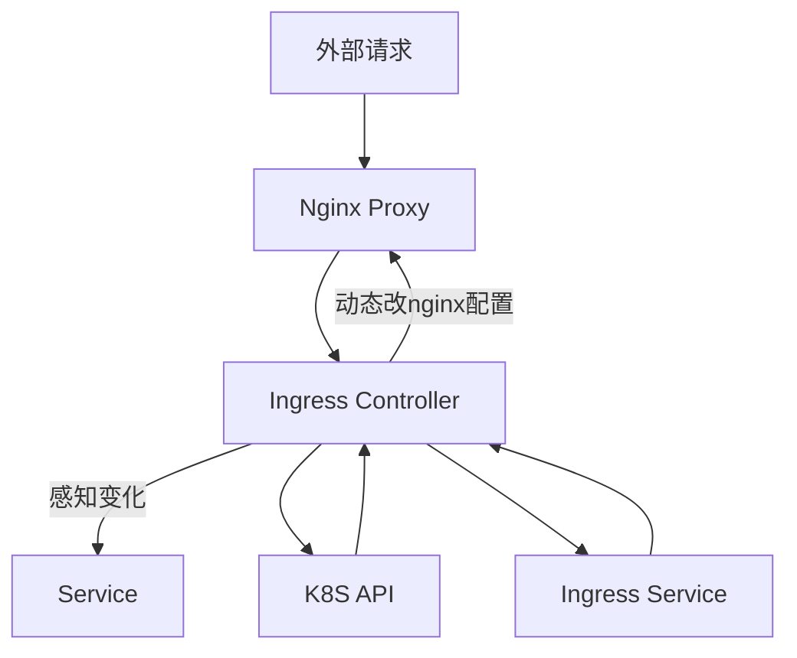

# K8S 进阶
# 一 理念和架构
## 1.1. K8S使用与学习理念
运维工作理念：
1. 命令式 -- 作业平台 上线平台 medivh
2. 声明式
    1. ansible
    2. salt-stack
    3. docker-compose
    4. k8s
目前现状  命令式 --->(转换) 声明式 
    1. 自动化平台 做描述，从0搭建一个，非常容易
    2. 容器化带来的推动
    3. 使得运维工作重建、恢复状态变得简单

## 1.2 K8S架构
 K8S架构图


### 1.2.1 Mater架构：
#### 1.2.1.1 组件
> API server:
    > 供Kubernetes API接口，主要梳理Rest操作以及更新etcd中的对象。所有资源增删改查的唯一入口。
>Scheduler:
    >绑定Pod到Node上，资源调度
>Controller Manager:
    >所有其他集群级别的功能，目前有控制器Manager执行。资源对象的自动化控制装修呢。
>Etcd:
    >所有持久化的状态信息存储在Etcd中。

**REST ( REpresentational State Transfer )，State Transfer 为 "状态传输" 或 "状态转移 "** 

* etcd保存了整个集群的状态；
* apiserver提供了资源操作的唯一入口，并提供认证、授权、访问控制、API注册和发现等机制；
* controller manager负责维护集群的状态，比如故障检测、自动扩展、滚动更新等；
* scheduler负责资源的调度，按照预定的调度策略将Pod调度到相应的机器上；
* kubelet负责维护容器的生命周期，同时也负责Volume（CSI）和网络（CNI）的管理；
* Container runtime负责镜像管理以及Pod和容器的真正运行（CRI）；
* kube-proxy负责为Service提供cluster内部的服务发现和负载均衡；
#### 1.2.1.2 高可用


### 1.2.2 Node架构

Node：运行Docker，kubelet(agent)，kube-proxy, Flannel

> Kubelet
> 管理Pods以及容器、镜像、Volume等，实现对集群节点的管理
> Kube-proxy
> 提供网络代理以及负载均衡，实现与Service通讯。
> Docker Engine
> 负责节点的容器的管理工作
> Flannel实现容器间的跨主机网络问题

### 1.2.3 high-level compontent architchture
**架构详解**

**k8s高级应用**


## 1.3 k8s与云原生应用


# 二 应用容器化
## 1. 分层构建

1. 操作系统
2. 运行环境
3. 应用

## 2. Dockerfile && build image


# 三 Pod介绍和管理
**Pod特性**

* Pod可以只运行一个单独的容器“one-container-per-Pod” 
* Pod中也可以运行多个有依赖关系的容器，一个Pod中的多个容器是紧耦合，共享资源的，可以通过localhost进行访问
* 每一个pod会分配一个唯一的IP地址，pod的IP地址是不固定的
* 一个Pod共享一个存储，访问同一个共享卷
* 同一个Pod中的多个容器，通过localhost通信，基于端口，由pause容器实现。

**pause容器的作用**

* pause容器提供pod中的多个容器的网络和存储的共享。
* 在Pod中担任linux命名空间的基础。
* 启用pid命名空间，开启init进程。


### 3.1 Pod的定义模板
YAML使用规则

1. 缩进
    1. YAML使用一个固定的缩进风格表示数据层结构关系
    2. 禁止使用Table键
2. 冒号（:）
    1. 冒号+空格定义KV （冒号后面有value的时候，必须在冒号和value间加一个空格）
3. 短横线
    1. 短横线 - 加一个空格，表示列表

`nginx-pod.yml`
```yaml
apiVersion: apps/v1             # 版本号
kind: Pod                      # 资源的类型
metadata:                      # 元数据
  name: nginx-pod              # metadata.name  Pod的名称
  labels:                     # metadata.labels 自定义标签列表
    app: nginx
spec:                         # Pod中容器的详细定义
  containers：                 # spec.containers容器列表
  - name: nginx               # spec.containers.name 容器名称
    image: nginx:1.13.12      # spec.containers.image 容器镜像名称
    ports:                   # 容器需要监听的端口号
      - containerPort: 80    # 容器监听的端口号  
```

```bash
# 创建pod
kubectl create -f nginx-pod.yml
# 查看pod详细信息
kubectl describe pod nginx-pod
# 查看pod节点详细信息
kubectl get pod -o wide
# 查看pod日志
kubectl logs pod/nginx-pod
# 删除pod
kubectl delete pod nginx-pod
```

### 3.2 Pod配置Secret拉取harbor镜像
```bash
[root@linux-node1 ~]# docker login 192.168.56.11
Authenticating with existing credentials...
WARNING! Your password will be stored unencrypted in /root/.docker/config.json. # 密码存储位置
Configure a credential helper to remove this warning. See
https://docs.docker.com/engine/reference/commandline/login/#credentials-store

Login Succeeded
[root@linux-node1 ~]#
```

```bash
cat /root/.docker/config.json |base64 > docker-pass
cat docker-pass
ewoJImF1dGhzIjogewoJCSIxOTIuMTY4LjU2LjExIjogewoJCQkiYXV0aCI6ICJZV1J0YVc0NlNH
RnlZbTl5TVRJek5EVT0iCgkJfQoJfSwKCSJIdHRwSGVhZGVycyI6IHsKCQkiVXNlci1BZ2VudCI6
ICJEb2NrZXItQ2xpZW50LzE4LjA2LjEtY2UgKGxpbnV4KSIKCX0KfQ==
```

```bash
vim harbor-secret.yml
####################################
apiVersion: v1
kind: Secret
metadata:
  name: harbor-secret
  namespace: default
data:
  .dockerconfigjson: ewoJImF1dGhzIjogewoJCSIxOTIuMTY4LjU2LjExIjogewoJCQkiYXV0aCI6ICJZV1J0YVc0NlNHRnlZbTl5TVRJek5EVT0iCgkJfQoJfSwKCSJIdHRwSGVhZGVycyI6IHsKCQkiVXNlci1BZ2VudCI6ICJEb2NrZXItQ2xpZW50LzE4LjA2LjEtY2UgKGxpbnV4KSIKCX0KfQ==
type: kubernetes.io/dockerconfigjson
####################################
```

```bash
kubectl create -f harbor-secret.yml
kubectl  get secret

####################################
NAME                  TYPE                                  DATA      AGE
default-token-v5hlf   kubernetes.io/service-account-token   3         17h
harbor-secret         kubernetes.io/dockerconfigjson        1         19s
####################################
```

在Pod中使用harbor仓库
```yaml
vim nginx-pod.yml
```
```yaml
apiVersion: v1
kind: Pod
metadata:
  name: nginx-pod
  labels:
    app: nginx
spec:
  containers:
  - name: nginx
    image: 192.168.56.11/k8s_test/nginx:1.13.12
    ports:
    - containerPort: 80
  imagePullSecrets:
    - name: harbor-secret
```


# 四 使用Controllers管理Pod
## 4.1 RC
    RC是k8s集群中最好的保证Pod高可用的API对象。通过监控运行汇总的Pod来保证集群中指定数据的Pod副本。指定的数据任意，大于等于1，Pod节点数量少于指定数据，RC就会启动运行的新的Pod副本。多于指定数据，RC就会杀死多于的Pod副本
    即使在指定数目为1的情况下，通过RC运行Pod也比直接运行Pod更明智。因为RC能发挥高可用的能力。保证永远有一个Pod在运行。

```bash
vim nginx-rc.yml
```
```yaml
apiVersion: v1
kind: ReplicationController
metadata:
  name: nginx-rc
spec:
  replicas: 3
  selector:
    app: nginx
  template:
    # 从这里开始 是相当于一个Pod.yaml文件
    metadata:
      name: nginx
      labels:
        app: nginx
    spec:
      containers:
      - name: nginx
        image: 192.168.56.11/devopsedu/nginx:1.13.12
        #image: nginx:1.13.12
        # 容器服务暴露的端口
        ports:
        - containerPort: 80
      imagePullSecrets:
        - name: harbor-secret
```

```bash
kubectl create -f nginx-rc.yml
kubectl get rc -o wide
kubectl get pod -o wide
# 滚动升级
kubectl rolling-update nginx-rc --image=nginx:1.14.0
# 动态扩容、缩减
kubectl scale rc nginx-rc --replicas=2
```

RS是新一代RC，提供同样的高可用能力，能支持更多的匹配模式。在标签选择的时候，支持的功能会更强大，一般配合下面的deployment来使用。
    具体哪些？？？咯咯哒

`vim nginx-rs.yml`
```yml
###########################################
apiVersion: apps/v1
kind: ReplicaSet
metadata:
  name: nginx-rs
  labels:
    app: nginx
spec:
  replicas: 3
  selector:
    ## 这里与rc的写法不同 标签选择的方式，多一行 matchLabels:
    matchLabels:
      app: nginx
  # 从这里开始 是相当于一个Pod.yaml文件
  template:
    metadata:
      name: nginx
      labels:
        app: nginx
    spec:
      containers:
      - name: nginx
        image: 192.168.56.11/devopsedu/nginx:1.13.12
        ports:
        - containerPort: 80
      imagePullSecrets:
        - name: harbor-secret
###########################################
```

```bash
kubectl create -f nginx-rs.yml
kubectl get rs -o wide
kubectl delete rs  nginx-rs
```

## 4.3 使用Deployment管理

* Deployment表示用户对k8s集群的一次更新操作。Deployment是一个比RS应用模式更广的API对象。
* 可以是创建一个新的服务，更新一个新的服务，也可以是滚动升级一个服务。滚动升级一个服务。实际是创建一个新的RS，然后逐渐将RS中副本数增加到理想状态，将旧RS中的副本数较少到0的复合操作。
* 这样一个符合操作用一个RS是不太好描述的，所以用一个更通用的Deployment来描述。


<u>使用的时候，不要手动去定义RS。Deployment又对rs做了一层封装。我们只要创建Deployment即可。</u>
**我们后续使用的都是Deployment**

`vim nginx-deployment.yml`
```yaml
###################################
apiVersion: apps/v1
kind: Deployment
metadata:
  name: nginx-deployment
  labels:
    app: nginx
spec:
  replicas: 3
  selector:
    matchLabels:
      app: nginx
  template:
    metadata:
      labels:
        app: nginx
    spec:
      containers:
      - name: nginx
        image: nginx:1.13.12
        ports:
        - containerPort: 80
###################################
```

```bash
# 创建 这个命令不会记录日志 生产不这么用
kubectl create -f nginx-deployment.yml 
kubectl get deploy
# 删除重建
kubectl delete deploy nginx-deployment
# 记录日志 版本号
kubectl create -f nginx-deployment.yml --record  
# 查看标签
kbg pod --show-labels   

# 更新deployment 镜像
kubectl set image deployment/nginx-deployment nginx=192.168.56.11/devopsedu/nginx:1.13.12
# 查看更新状态 
kubectl  rollout status deployment/nginx-deployment
# 查看版本历史
kubectl rollout history deployment/nginx-deployment
# 查看指定版本 的具体操作
kubectl rollout history deployment/nginx-deployment  --revision=2
# 回滚到上一个版本
kubectl rollout undo deployment/nginx-deployment
# 指定版本回滚
kubectl rollout undo deployment/nginx-deployment --to-revusion=2
# 扩容
kubectl scale deployment nginx-deployment --replicas 5

#1. 创建deployment
kubectl create -f nginx-deployment.yml
kubectl create -f nginx-deployment.yml --record  

#2. 查看deployment
kubectl get deployment
#3. 查看pod
kubectl get pod -o wide
#4. 测试pod访问
curl --head http://10.2.x.x
#5. 更新deployment
kubectl set image deployment/nginx-deployment nginx=nginx:1.12.2 --record
#6. 查看更新后的Depolyment
kubectl get deployment -o wide
#7. 查看更新历史
kubectl rollout history deployment/nginx-deployment
#8. 查看具体某一个版本的升级历史
kubectl rollout history deployment/nginx-deployment --revision=1
#9. 快速回滚到上一个版本
kubectl rollout undo deployment/nginx-deployment 
#10. 指定版本回滚
kubectl rollout undo deployment/nginx-deployment --to-revusion=2
#11. 自动扩容
kubectl scale deployment nginx-deployment --replicas 5

#12. 创建service
kubectl  create -f nginx-service.yml
#13. 查看service
kubectl get  service
```

## 4.4 DaemonSet管理Pod和Node

什么是DaemonSet？
* DaemonSet确保全部(或者一些)Node上运行一个Pod副本。当有Node加入集群时，也会为他们新增一个Pod。
* 当有Node从集群移除时，这些Pod也会被回收。
* 删除DaemonSet将会删除它创建的所有Pod。

### 4.4.1 DaemonSet
`vim nginx-daemonset.yml`
```yml
#############################
apiVersion: apps/v1
kind: DaemonSet
metadata:
  name: nginx-daemonset
  labels:
    app: nginx
spec:
  selector:
    matchLabels:
      app: nginx
  template:
    metadata:
      labels:
        app: nginx
    spec:
      containers:
      - name: nginx
        image: nginx:1.13.12
        ports:
        - containerPort: 80
###############################
```
```bash
kubectl create -f nginx-daemonset.yml
kubectl get deamonset
```

### 4.4.2 Node Selector 
将Pod运行在指定的Node上！例如将某类应用运行在SSD磁盘的服务器上
```bash
# 给node56.13设置一个标签
kubectl label nodes 192.168.56.13 disktype=ssh 

# 查看node的标签
kubectl get  node --show-labels

# 查看 删除之前创建的 deamonset
kubectl get deamonset
kubectl delete daemonset nginx-daemonset

# 在上面的yml文件中加入node选择器，和containers是同一级别的
nodeSelector：
  disktype: ssd

kubectl create -f nginx-daemonset.yml
kubectl get deamonset # 发现只在我们打labels的56.13上启动了一个Pod
```

### 4.4.3 label操作
```bash
# label操作
kubectl label nodes 192.168.56.13 disktype=sssd
kubectl  label nodes 192.168.56.13 disktype=ssd --overwrite
kubectl get  node --show-labels
kubectl label nodes 192.168.56.13 contentktype=ssh
kubectl delete  label nodes 192.168.56.13 contentype=ssh
kubectl label nodes 192.168.56.12 edgenode=true
```

## 4.5 Statefulset
### 4.5.1 Statefulset介绍
什么情况使用StatefulSet？ 有状态服务

StatefulSet是一种给Pod提供唯一标志的控制器，它可以保证部署和扩展的顺序。
* 稳定性，唯一的网络标识符。
* 稳定性，持久化存储。
* 有序的部署和扩展。
* 有序的删除和终止。
* 有序的自动滚动更新。


Pod一致性：包含次序（启动、停止次序）、网络一致性。此一致性与Pod相关，与被调度到哪个node节点无关。
稳定的次序：对于N个副本的StatefulSet，每个Pod都在[0，N)的范围内分配一个数字序号，且是唯一的。
稳定的网络：Pod的hostname模式为(statefulset名称)−(序号)。
稳定的存储：通过VolumeClaimTemplate为每个Pod创建一个PV。删除、减少副本，不会删除相关的卷。

Pod调度运行时，如果应用不需要任何稳定的标示、有序的部署、删除和扩展，则应该使用一组无状态副本的控制器来部署应用，例如 Deployment 或 ReplicaSet更适合无状态服务需求。


### 4.5.2 Statefulset示例

下面的示例中描述了 StatefulSet 中的组件。

* 一个名为 nginx 的 headless service，用于控制网络域。
* 一个名为 web 的 StatefulSet，它的 Spec 中指定在有 3 个运行 nginx 容器的 Pod。
* volumeClaimTemplates 使用阿里云盘提供的 PersistentVolumes 作为稳定存储。

`nginx-statsfulset.yaml`
```yaml
apiVersion: v1
kind: Service
metadata:
  name: nginx
  labels:
    app: nginx
spec:
  ports:
  - port: 80
    name: web
  clusterIP: None
  selector:
    app: nginx
---
apiVersion: apps/v1beta2
kind: StatefulSet
metadata:
  name: web
spec:
  selector:
    matchLabels:
      app: nginx
  serviceName: "nginx"
  replicas: 2
  template:
    metadata:
      labels:
        app: nginx
    spec:
      containers:
      - name: nginx
        image: nginx
        ports:
        - containerPort: 80
          name: web
        volumeMounts:
        - name: disk-ssd
          mountPath: /data
  # 使用阿里云云盘创建strogeClass
  volumeClaimTemplates:
  - metadata:
      name: disk-ssd
    spec:
      accessModes: [ "ReadWriteOnce" ]
      # storageClassName配置为alicloud-disk-ssd，表示使用阿里云SSD类型云盘
      storageClassName: "alicloud-disk-ssd"
      resources:
        requests:
          storage: 20Gi
```

比较重要的PV的accessModes属性：

* ReadWriteOnce——该卷可以被单个节点以读/写模式挂载
* ReadOnlyMany——该卷可以被多个节点以只读模式挂载
* ReadWriteMany——该卷可以被多个节点以读/写模式挂载

在命令行中，访问模式缩写为：

* RWO - ReadWriteOnce
* ROX - ReadOnlyMany
* RWX - ReadWriteMany


### 4.5.3 测试Statefulset
```bash
kubectl create -f statefulset.yaml
kubectl get pod
kubectl scale sts web --replicas=3
kubectl get pod
kubectl get pvc

# 缩容到两个服务，pvc不会删除
kubectl scale sts web --replicas=2
kubectl get pod
kubectl get pvc

# 再次扩容到3个Pod，新的pod会复用原来的PVC/PV：
kubectl scale sts web --replicas=3
kubectl get pod
kubectl get pvc
```
**结论： 删除StatefulSet服务，PVC并不会随着删除**

### 4.5.4 验证服务稳定性
```bash
# 查看Pod引用的PVC：
kubectl describe pod web-1 | grep ClaimName
   ## ClaimName:  disk-ssd-web-1
# 删除Pod后，重新创建的Pod名字与删除的一致，且使用同一个PVC：
kubectl get pod
kubectl describe pod web-1 | grep ClaimName
```

### 4.5.5 验证服务高可用性
```bash
# 创建测试文件
kubectl exec web-1 ls /data
kubectl exec web-1 touch /data/statefulset
kubectl exec web-1 ls /data

# 删除Pod验证数据持久性
kubectl delete pod web-1
kubectl exec web-1 ls /data
```

## 4.6 Job和CronJob
### 4.6.1 Job
`job-demo.yaml`
```yaml
apiVersion: batch/v1
kind: Job
metadata:
  name: job-demo
spec:
  template:
    metadata:
      name: job-demo
    spec:
      restartPolicy: Never
      containers:
      - name: counter
        image: nginx:1.13.12
        command:
        - "bin/sh"
        - "-c"
        - "for i in 9 8 7 6 5 4 3 2 1; do echo $i; done"
```
`# 使用kubectl 观察者模式查看Pod的状态`
`kubectl  get  pod --watch=true （-w）`

### 4.6.2 CronJob
`cronjob-demo.yaml`
```yaml
apiVersion: batch/v1beta1
kind: CronJob
metadata:
  name: cronjob-demo
spec:
  schedule: "*/1 * * * *"
  jobTemplate:
    spec:
      template:
        spec:
          restartPolicy: OnFailure
          containers:
          - name: hello
            image: nginx:1.13.12
            args:
            - "bin/sh"
            - "-c"
            - "for i in 9 8 7 6 5 4 3 2 1; do echo $i; done"
```
`# 使用kubectl 观察者模式查看Pod的状态`
`kubectl  get  pod --watch=true （-w）`


# 五 Pod深入学习
## 5.1 Pod的多种状态
Pod的状态共有5种，分别如下：

* Pending： APIServer已经创建该Pod，但是Pod内还有容器的奖项没有创建或者正在下载，或者资源不满足调度；
* Running： Pod张所有容器均已创建，且至少有一个容器处于运行、正在启动、正在重启状态；
* Succeeded：Pod中所有容器均已成功退出，且不会重启；
* Failed： Pod找给你所有容器均已退出，但至少有一个容器处于失败状态；
* UnKnown: 由于某种原因无法获取该Pod的装填，可能由于网络不畅所致。

## 5.2 重启策略
### 5.2.1 Pod的重启策略
Pod的重启策略有三种，默认值为always。

* Always： 容器失效时，kubelet自动重启该容器；
* OnFailure：容器终止运行切退出代码不为0时重启；
* Never： 不论状态为何，kubelet都不容器该容器。

### 5.2.2 每种控制器对pod的重启策略

*  Pod的重启策略与控制方式有关，每种控制器对Pod的重启策略要求如下:
*  RS和DaemonSet: 必须设置为Always
*  Job: OnFilure或Never
*  Kubelet（静态Pod): Pod失效时自动重启，且不进行健康检查。


## 5.3 Pod的高级用法
### 5.3.1 Podhook 钩子
#### Podhook 介绍
**Pod**是kubernetes集群中的*最小单元*，而pod是由容器组成的，所以在讨论pod的生命周期的时候我们可以先来讨论下容器的生命周期。
kubernetes为我们的容器提供了生命周期钩子，就是我们所说的Pod Hook。

* **Pod hook**是由*kubelet*发起的，实际上我们可以为pod中的所有容器都配置hook。

K8s为我们提供了两种钩子函数：
* **Poststart**：这个钩子在容器创建之后立即执行，不过这个地方使用的时候注意事项是钩子启动的时间不能过长，否则引起容器不能达到running状态；
* **Prestop**：这个钩子在容器终止之前立即被调用，它是阻塞的，意味着它是同步的，所以它必须在删除容器的调用发起之前完成。主要用于优雅的关闭应用程序、通知其他系统等；如果钩子在执行期间挂起，pod阶段将停留在running阶段且不会达到failed状态。

*小结：我们应该让钩子函数尽可能的轻量，当然有些情况下，长时间运行命令是合理的，比如优雅的关闭容器。*
**Podhook实现方式**
* Exec:用于执行一段特定的命令，不过需要注意的是该容器消耗的资源会被计入容器；
* http：对容器上的特定端口执行http请求；

**Podhook demo**
* Demo1:展示容器启动成功之后，执行的命令；
    个人使用示例，在build镜像的时候忘记mdkir logdir，容器无法启动，或者根据pod的Ip创建文件目录。
* Demo2:优雅的关闭容器，使用到的是prestop 
    比如nginx，先处理完所有的请求，再关闭容器 `nginx -s quit`


#### 5.3.2 Pod健康检查
**pod健康检查工具**
除了上文的钩子函数之外，还有一项配置会影响到容器的生命周期，那就是健康检查的探针；
* **liveness probe:** 存活探针，主要是用来判断应用程序是否正在运行，理论上来讲，程序一旦崩溃k8s就会知道这个程序已经崩溃了，然后重启这个容器。而liveness probe可以帮我们更加迅速的发现应用系统bug，同时重启这个应用程序。
* **Readiness probe:** 来确定容器是否已经就绪可以来接收流量了，如果可以接收流量之后就可以将pod加入到service里面。

**Pod健康检查的实现**
和上面谈论的钩子函数一样，也支持如下三种方式：
- exec:执行一段命令
- http:检测某个http请求
- tcpsocket: kubelet将尝试在指定端口上打开容器的套接字，如果可以建立连接，容器认为是健康的；如果不能则认为是失败的。

**案例一**
```yaml
apiVersion: apps/v1
kind: Deployment
metadata:
  name: liveness-http-deployment
  labels:
    app: nginx
spec:
  replicas: 1
  selector:
    matchLabels:
      app: nginx
  template:
    metadata:
      labels:
        app: nginx
    spec:
      containers:
      - name: nginx
        image: nginx:1.13.12
        ports:
        - containerPort: 80
        args:
        - /bin/sh
        - -c
        - touch /tmp/healthy;sleep 30s; rm -rf /tmp/healthy;sleep600
        lifecycle:
          postStart:
            exec:
              command: ["/bin/bash","-c","echo devopsedu > /tmp/health"]
        livenessProbe:
          httpGet:
            path: / 
            port: 80
          initialDelaySeconds: 1
          periodSeconds: 5
```
实践：
```yaml
apiVersion: apps/v1
kind: Deployment
metadata:
  name: nginx-deployment
  labels:
    app: nginx
spec:
  replicas: 3
  selector:
    matchLabels:
      app: nginx
  template:
    metadata:
      labels:
        app: nginx
    spec:
      containers:
      - name: nginx
        image: nginx:1.13.12
        ports:
        - containerPort: 80
        readinessProbe:
          httpGet:
            scheme: HTTP
            path: /healthy
            port: 80
          initialDelaySeconds: 10
          periodSeconds: 5
        resources:
          requests:
            memory: "64Mi"
            cpu: "250m"
          limits:
            memory: "128Mi"
            cpu: "500m"
        volumeMounts:
        - mountPath: "/usr/share/nginx/html"
          name: pvc-demo
      volumes:
      - name: pvc-demo
        persistentVolumeClaim:
          claimName: pvc-demo
```

##### 实例文件
`存活探测`
```yaml
apiVersion: apps/v1
kind: Deployment
metadata:
  name: liveness-http-deployment
  labels:
    app: nginx
spec:
  replicas: 1
  selector:
    matchLabels:
      app: nginx
  template:
    metadata:
      labels:
        app: nginx
    spec:
      containers:
      - name: nginx
        image: nginx:1.13.12
        ports:
        - containerPort: 80
        args:
        - /bin/sh
        - -c
        - sleep 30s; rm -rf /tmp/healthy;sleep600
        #- touch /tmp/healthy;sleep 15s; rm -rf /tmp/healthy;sleep600
        lifecycle:
          postStart:
            exec:
              command: ["/bin/bash","-c","echo healthy-test > /tmp/health"]
        livenessProbe:
          exec:
            command:
              - grep "healthy-test" /tmp/healthy
          initialDelaySeconds: 1
          periodSeconds: 5
```

`资源限制`
```yaml
apiVersion: apps/v1
kind: Deployment
metadata:
  name: sz
  labels:
    app: nginx
spec:
  replicas: 1
  selector:
    matchLabels:
      app: nginx
  template:
    metadata:
      labels:
        app: nginx
    spec:
      containers:
      - name: nginx
        image: nginx:1.13.12
        ports:
        - containerPort: 80
        resources:
          limits:
            cpu: 2000m
            memory: 400M
          requests:
            cpu: 200m 
            memory: 100M
```

#### 5.3.3 init container
初始化容器,暂时未用到。

# 六 使用service管理Pod访问
[相关文档](http://docs.kubernetes.org.cn/703.html)

- RC、RS和Deployment只是保证了支撑服务的Pod的**数量**，但是没有解决如何**访问**这些服务的问题。一个Pod只是一个运行服务的实例，随时可能在一个节点上停止，在另一个节点以一个新的IP启动一个新的Pod，因此不能以确定的IP和端口号提供服务。
- 要稳定的提供服务需要服务发现和负载均衡能力。服务发现完成的工作，是针对客户端访问的服务，找到对应的后端服务实例。
- 在K8S集群中，客户端需要访问的服务就是Service对象。每个Service会对应一个集群内部有效的虚拟IP，集群内部通过虚拟IP访问一个服务。
- Service Controller是属于kubernetes集群与外部的云平台之间的一个接口控制器。Service Controller监听Service变化，如果是一个LoadBalancer类型的Service，则确保外部的云平台上对该Service对应的LoadBalancer实例被相应地创建、删除及更新路由转发表。

## 6.1 使用service为Pod提供服务发现
### 6.1.1 创建service

`vim nginx-service.yml `

```yml
##########################
kind: Service
apiVersion: v1
metadata:
  name: nginx-service
spec:
  selector:
    app: nginx
  ports:
  - protocol: TCP # 或者UDP
    port: 80  # service对外端口
    targetPort: 80  # Pod提供服务端口
##########################
```

service端口命名方式
```yml
##########################
kind: Service
apiVersion: v1
metadata:
  name: nginx-service
spec:
  selector:
    app: nginx
  ports:
  - name: http
    protocol: TCP # 或者UDP
    port: 80  # service对外端口
    targetPort: 80  # Pod提供服务端口，这里也可以使用pod中对端口的命名
  - name: https
    protocol: TCP # 或者UDP
    port: 443  # service对外端口
    targetPort: 443  # Pod提供服务端口
##########################
```


```bash
kubectl create -f nginx-service.yml
```

创建service后，会有一个clusterIP，这个IP在master上并不能直接访问，master上没有kube-proxy。

## 5.2 使用NodePort从集群外部访问
K8S中的IP地址
* Node IP:节点设备的IP,如物理机、虚拟机、ECS等容器宿主机的实际IP。
* PodIP：Pod的ip地址，是根据docker0网格IP段进行分配的。
* Cluster IP：service的IP，是一个虚拟IP，近作用域service对象，由k8s管理和分配，需要解决service port才能使用，单独的IP没有通信功能。**所以直接ping service的clusterIP是不通的** 集群外访问需要一些修改(NodePort)
* 在k8s集群内部，NodeIP、PodIP和ClusterIP的通信机制是由k8s指定的路由规则，不是IP路由

`vim nginx-NodePort.yml`

```yml
##########################
kind: Service
apiVersion: v1
metadata:
  name: nginx-service
spec:
  selector:
    app: nginx
  ports:
  - protocol: TCP
    port: 80
    targetPort: 80
  # 加入下面一行
  type: NodePort
##########################
```
```bash
# 更新yaml文件：
kubectl apply -f nginx-service.yml
kubectl get service -o wide # 可以看到打开了外部端口 (这里是29299)
#浏览器访问：  nodePort  需要使用nodeIP访问
http://192.168.56.12:29299
http://192.168.56.13:29299
```

## 6.3 endpoint
连接service与Pod的通信

## 6.4 coreDNS 解析格式： 
`<service_name>.<namespace>.svc.<cluster_domain>`

其中cluster_domain可以使用kubelet的–cluster-domain=SomeDomain参数进行设置，同时也要保证kube2sky容器的启动参数中–domain参数设置了相同的值。通常设置为cluster.local。那么之前示例中的my-nginx Service对应的完整域名就是my-nginx.default.svc.cluster.local。看到这里，相信很多人会有疑问，既然完整域名是这样的，那为什么在Pod中只通过Service名称和Namespace就能访问Service呢？下面来解释其中原因。


# 七 使用Ingress提供外部访问
## 7.1 Ingerss介绍
Service NodePort只能实现四层的负载均衡，K8S本身没有实现七层的负载均衡，只提供了Ingress接口。想要实现Ingress的功能，需要一个Ingress Controller来实现。实际上是一个监视器。不停的与kube-api通信，获取集群状态。

Ingress简介：
Ingress简单点说就是外部访问集群的一个入口，将外部的请求转发到集群内部不同的service上，其实就相当于nginx/haproxy等负载均衡代理服务器，但是我们直接使用nginx或者haproxy这种方作为service的代理时有很大的缺陷，每次有新的service加入的时候怎么改nginx？每次都需要更改nginx配置，再手动reload。这些功能Ingress已经实现。。。

## 7.2 Ingress组成
Ingress由两部分组成:Ingress Controller和Ingress服务
Ingress Controller体现为一个Pod容器，里面运行着nginx proxy+nginx-ingress-controller



Ingress Controller可以理解为一个监听器。通过与K8S API交互，实时的感知service/Pod的变化，Ingress Controller再结合Ingress的配置，去更新反向代理服务器。

## 7.3 Ingress Controller种类
Traefik/nginx-controller/kubernetes ingress controller for kong/haproxy ingress controller。你也可以自己实现一个ingress controller，现在普篇用的较多的是traefix和nginx-controller。

这里介绍两种Ingress Controller。一是自己部署一个与集群无关的nginx环境来实现，但是一些高级的功能需要用到Ng的企业版Nginx Plus。Kubernetes提供的方案是Ingress。另一种是Traefik。它可以与微服务，与K8S直接做集成。

## 7.4 使用Traefik实现Ingress
[Ingress官网地址](https://v1-10.docs.kubernetes.io/docs/concepts/services-networking/ingress/)
工具：[Traefik](https://traefik.io/)

https://docs.traefik.io/img/architecture.png

```
kubectl label nodes 192.168.56.12 edgenode=true
cd Ingress/ # 进入相关目录（补全笔记，salt代码中的文件）
kubectl create -f .
http://192.168.56.12:8580/dashboard/
```

添加路由
[官方安装使用文档](https://docs.traefik.io/user-guide/kubernetes/)
```YAML
# 官网摘录：

# Now we can submit an ingress for the cheese websites.
apiVersion: extensions/v1beta1
kind: Ingress
metadata:
  name: cheese
  annotations:
    kubernetes.io/ingress.class: traefik
spec:
  rules:
  - host: stilton.minikube
    http:
      paths:
      - path: /
        backend:
          serviceName: stilton
          servicePort: http
  - host: cheddar.minikube
    http:
      paths:
      - path: /
        backend:
          serviceName: cheddar
          servicePort: http
  - host: wensleydale.minikube
    http:
      paths:
      - path: /
        backend:
          serviceName: wensleydale
          servicePort: http
```

我们自己写一个nginx-ingress.yml
```bash
vim nginx-ingress.yml
```
```yaml
apiVersion: extensions/v1beta1
kind: Ingress
metadata:
  name: nginx-ingress
spec:
  rules:
  - host: www.example.com
    http:
      paths:
      - path: /
        backend:
          serviceName: nginx-service # 这里要与service的名字以及端口相匹配
          servicePort: 80
```

```bash
# 创建
kubectl create -f nginx-ingress.yaml
# 查看
kubectl describe ingress nginx-ingress
# 根据端口可在UI界面访问
```

## 7.5 Nginx实现Ingress Controller


# 八 存储

* Volume是Pad中能够被多个容器访问的共享目录
* Kubernetes中的Volume与Pod生命周期相同，但与容器的生命周期不相关
* Kubernetes支持多种类型的Volume，并且一个Pod可以同时使用任意多个Volume
* Volume类型包括: 
    1. EmptyDir：Pod分配时创建，K8S自动分配，当Pod被移除数据被清空。用于临时空间等。
    2. hostPath： 为Pod上挂载宿主机目录。用于持久化数据。
    3. gcePersistentDisk、awsElasticBlockStore：挂载公有云盘。
    4. nfs、iscsi、glusterfs、rbd、gitRepo：挂载相应磁盘资源。
    5. Configmap和secret 对于一些配置文件活着敏感信息可以使用configmap和secret同时注意配置rbac授权等；

kubernetes为了大家更好的使用存储资源，引入了pv和pvc两个重要的资源对象来实现对存储的管理。 


